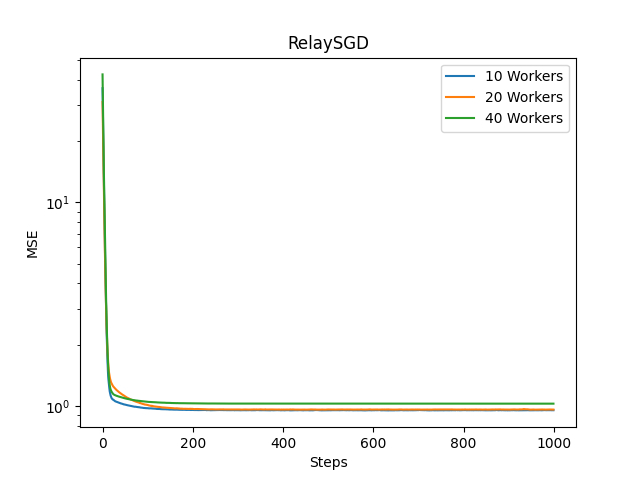

# RelaySGD

Some POC implementations for the algorithms mentioned in this paper:

https://doi.org/10.48550/arXiv.2110.04175

## Distributed Mean Estimation using RelaySum (Algorithm 5)

The MST of a randomly generated network was used as topology in this experiment.

```bash
$ python relaysum.py
```


## RelaySGD (Algorithm 1)

In this experiment the function `f(x) = 3x + 4` was estimated using RelaySGD. The same topology was used as in the RelaySum experiment.

```bash
$ python relaysgd.py
```


