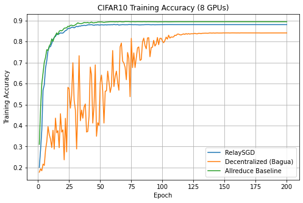
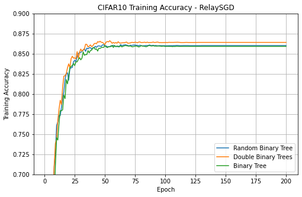

# RelaySGD

Implementation of RelaySGD[^1] inside of Bagua[^2].

[^1]: https://doi.org/10.48550/arXiv.2110.04175

[^2]: https://github.com/BaguaSys/bagua/tree/master

## Observation so far

### CIFAR10
CIFAR10 dataset, heterogeneously distributed with alpha=0.1 using the non iid dirichlet distribution split. 

#### Comparing the decentraliced algorithm in bagua with RelaySGD

#### Comparing different topologies of RelaySGD

