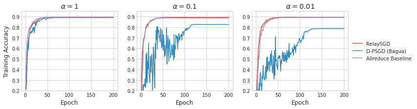
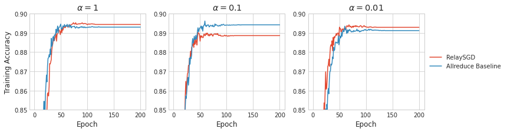
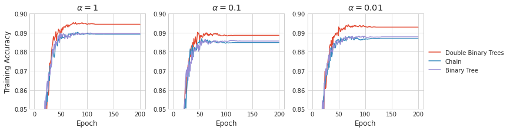

# RelaySGD

Implementation of the decentralized learning algorithm RelaySGD[^1] inside of Bagua[^2] for my [Bachelor Thesis](bachelor_thesis_samuel_bohl_final.pdf).

[^1]: https://doi.org/10.48550/arXiv.2110.04175

[^2]: https://github.com/BaguaSys/bagua/tree/master

You can run the benchmark using an installed version of bagua with:

`python3 -m bagua.distributed.launch --nproc_per_node=<number of gpus> benchmark.py --algorithm relay`

You can also provide some parameters:

 `python3 -m bagua.distributed.launch --nproc_per_node=<number of gpus> benchmark.py --algorithm relay --lr <learning rate> --alpha <data heterogeneity parameter> --topology <relay togology e.g. chain>`

## Experiment Evaluation

The `logs` folder contains the output of all the runs. 

To tune the hyperparameters, modify and run the following scripts: `hpt_relay.sh` and `hpt_rest.sh`. The output is saved in the logs folder as `summary*.txt`. The `final_run.sh` script executes the below shown experiment using the best learning rates on 8 GPUs.

The second experiment evaluates the throughput of different algorithms. (`synth_benchmark_run.sh`)

### CIFAR10 - VGG11

#### Comparing the decentraliced algorithm in bagua with RelaySGD

#### RelaySGD vs Allreduce

#### Comparing different topologies of RelaySGD

