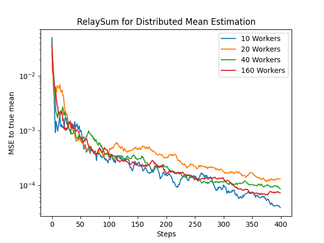

# RelaySGD

Some POC implementations for the algorithms mentioned in this paper:

https://doi.org/10.48550/arXiv.2110.04175

## Distributed Mean Estimation using RelaySum (Algorithm 5)

The MST of a tandomly generated network was used as topology in this experiment.

```bash
$ python relaysum.py
```


